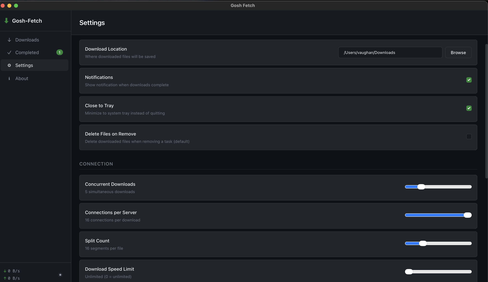

# Gosh-Fetch

A cross-platform download manager for Windows, Linux, and macOS. Built with Tauri v2 (Rust) and Svelte/TypeScript.

## Philosophy

Gosh apps are built with a Linux-first mindset: simplicity, transparency, and user control.

We also provide Windows and macOS builds not as a compromise, but as an on-ramp. Many people are curious about Linux but still live on other platforms day-to-day. If these tools help someone get comfortable and eventually make the jump, we're happy to meet them where they are.

## Screenshots




## Features

- Download HTTP/HTTPS, FTP, and BitTorrent files
- Magnet link support with metadata retrieval
- Multi-segment downloads for faster speeds
- SHA-256/MD5 checksum verification support
- Cross-platform: Windows, Linux, macOS
- Light/Dark/System theme support
- System tray integration with minimize-to-tray
- No telemetry, accounts, or cloud features

### Download Management
- Real-time progress tracking with speed metrics
- Pause, resume, and cancel downloads
- Batch operations (Pause All, Resume All)
- Download queue management
- Automatic retry on failure
- Custom output filename per download
- Per-download speed limiting

### BitTorrent Support
- Torrent file and magnet link support
- DHT, PEX, and Local Peer Discovery
- Seeder/peer count monitoring
- Configurable seed ratio
- Auto-update tracker lists from community sources
- Selective file download from torrents

### Connection Settings
- Concurrent downloads limit (1-20)
- Connections per server (1-16)
- Segments per download (1-64)
- Global download/upload speed limits
- Custom user agent support

## Requirements

### All Platforms
- [Node.js](https://nodejs.org/) 18+
- [Rust](https://rustup.rs/) 1.70+

### Linux
- `libwebkit2gtk-4.1-dev`
- `libappindicator3-dev`
- `librsvg2-dev`

On Debian/Ubuntu:
```bash
sudo apt install libwebkit2gtk-4.1-dev libappindicator3-dev librsvg2-dev
```

### Windows
- WebView2 (included in Windows 10/11)

### macOS
- Xcode Command Line Tools
- Minimum macOS 10.13 (High Sierra)

## Building

```bash
# Install dependencies
npm install

# Development
npm run tauri dev

# Production build
npm run tauri build
```

## Usage

1. **Add Download** — Click the + button and enter a URL, magnet link, or select a torrent file
2. **Monitor Progress** — View real-time speed, progress, and ETA for each download
3. **Manage Downloads** — Pause, resume, or remove downloads individually or in batch
4. **View Completed** — Access download history and open completed files

The download list auto-refreshes in real-time. Downloads use configurable multi-segment transfers for optimal performance.

## Error Handling

- **Download stalled:** The download has no active connections. Check your network or try resuming.
- **Connection failed:** Unable to reach the server. Verify the URL and your network connection.
- **Torrent has no seeds:** No peers available to download from. The torrent may be inactive.

## Third-Party Software

### aria2

This application uses [aria2](https://github.com/aria2/aria2) as its download engine.

aria2 is licensed under the **GNU General Public License Version 2, June 1991**.

Special thanks to the aria2 project. Gosh-Fetch is not affiliated with the aria2 project.

### OpenSSL

aria2 links with [OpenSSL](https://www.openssl.org) for TLS/SSL support.

OpenSSL is licensed under the **Apache License, Version 2.0** (OpenSSL 3.0+) and the **OpenSSL License / SSLeay License** (dual BSD-style licenses for earlier versions).

Special thanks to the OpenSSL project.

## Disclaimer

This application is an independent project and is not sponsored by, endorsed by, or affiliated with the aria2 project or the OpenSSL project.

This software is licensed under the GNU Affero General Public License v3.0 (AGPL-3.0). It is provided "as is", without warranty of any kind, express or implied, including but not limited to the warranties of merchantability or fitness for a particular purpose. Use at your own risk.

## License

AGPL-3.0 - See [LICENSE](LICENSE)

## Roadmap

Planned features for future releases:

- **Browser Extension** — One-click downloads from your browser
- **Download Scheduler** — Schedule downloads for off-peak hours
- **Bandwidth Scheduler** — Time-based speed limit profiles
- **RSS Feed Support** — Automatic downloads from RSS/podcast feeds
- **Download Categories** — Organize downloads by type with custom save locations
- **Import/Export** — Backup and restore download history and settings

## Contributing

Contributions welcome. Please open an issue first for major changes.
